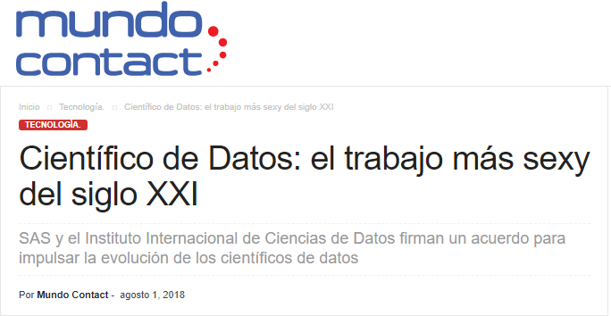
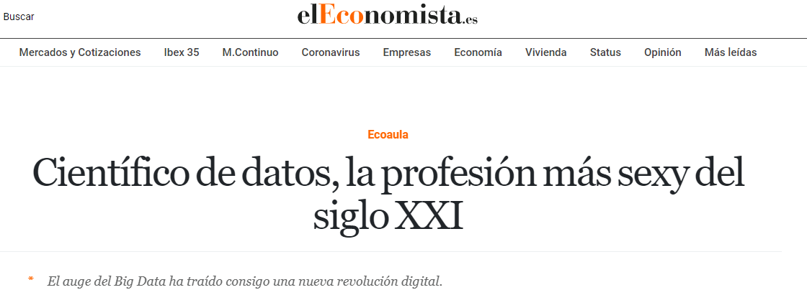
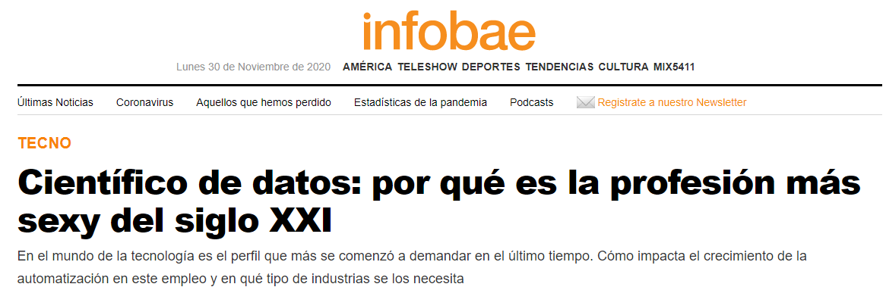

background-image: url(imagen/BEST.png)
<!-- background-position: center -->
background-size: contain 
<!-- cover -->
---

class: center,middle

# **¡Bienvenidos a Manos a la data!**


---
class: inverse, center, middle

# Por favor apaguen sus cámaras y micrófonos

.pull-left[

]

.pull-right[

]


---
# Agenda
<!-- para presentacones incrementales -->
--
.left-column[
### Día 1

* Motivación
* Manos a la Data
* Data Science
* R y Rstudio
* Paquetes necesarios
* ¿Qué es web scraping?
* Página web, sitio web, y aplicación web
* Reto
]
--
.right-column[
.pull-left[

### Día 2
* Motivación
* Manos a la Data
* Data Science
* R y Rstudio
* Paquetes necesarios
* ¿Qué es web scraping?
* Página web, sitio web, y aplicación web
* Reto
]
.pull-right[

### Día 3
* Motivación
* Manos a la Data
* Data Science
* R y Rstudio
* Paquetes necesarios
* ¿Qué es web scraping?
* Página web, sitio web, y aplicación web
* Reto
]
]

---
class: inverse, center

# Motivación
 
 .center["No se puede elegir sabiamente una vida a menos que se atrava uno a escucharse a sí mismo a *su propio yo*, en cada momento de la vida. **ABRAHAM H. MASLOW** [The farther Reaches of Human Nature, 1971].]

.pull-left[

```{r Intrin,echo=FALSE,cache=FALSE,out.height="400px",out.width="550px",fig.cap="Fuente: Imagen 1"}

# url
knitr::include_graphics("https://1.bp.blogspot.com/-EBTx-M7hLLg/X3UFZzk3_8I/AAAAAAAAAZY/_c86m_XTjWgUG-NyIcsP6mUIqpV7YLOwgCNcBGAsYHQ/s0/images.png")

```

<!--  -->
]

.pull-right[
```{r Extrin, echo=FALSE,cache=FALSE,out.height="400px", out.width="550px",fig.cap="Fuente: Imagen 2"}
# local

```

<!--  -->
]

---
class: center, middle, bottom, inverse
```{r Gtrends,eval=FALSE,echo=FALSE,cache=FALSE,message=FALSE,warning=FALSE,out.height="550px", out.width="1050px"} 
#Para que no lo descarge: eval=FLASE
library(tidyverse) #Conjunto de paquetes - 8
library(plotly)
library(gtrendsR) #para bajar información de google trends

# Obtener datos de Google trends

#Sobre web scraping
DataTendenciaWS<-gtrends("web scraping",geo = "",
                          time = "today+5-y",gprop = c("web"),
                          category = 0,hl = "es",low_search_volume = FALSE)
DataWS<- DataTendenciaWS$interest_over_time

DataTendenciaDS<- gtrends("data science",geo = "",
                         time = "today+5-y",gprop = c("web"),
                         category = 0,hl = "es",low_search_volume = FALSE)
DataDS <- DataTendenciaDS$interest_over_time
#Juntamos los datos
DataTotal <- rbind(DataWS,DataDS)

Grafico1 <- ggplot(DataTotal,aes(x =date,y =hits))+
  geom_line(aes(color = keyword),size=0.5)+
  labs(title = "Búsquedas en internet sobre data science y web scraping\n ¿Vale la pena especializarse?",
       subtitle = "En los últimos 5 años",caption = "Data: Google trends")+
  theme_minimal()
ggplotly()

```

# ¡Hay algo más para motivarse!

---
# ¿Qué es Manos a la Data?

+ Un proyecto semanal opensource liderado por BEST!
+ Se busca impulsar la Ciencia de Datos en Perú para todas las carreras!
+ Se busca ayudar en la enseñanza de DS con ejemplos concretos de nuestra realidad con diversas temáticas y tipos de bases de datos (PDF, excels, txt, csv,
mapas, etc).
+ Siéntase libres de compartir las Bases de Datos semanales para practicar o
enseñar.
+ ¡Recuerden que también es importante ofrecer créditos!

---
class: top
# ¿Qué es Data Science?

.pull-left[Data science is a set of fundamental principles that support and guide the principled extraction of information and knowledge from data. Possibly the most closely related concept to data science is data mining—the actual extraction of knowledge from data via technologies that incorporate these principles. There are hundreds of different data-mining algorithms, and a great deal of detail to the methods of the field. We argue that underlying all these many details is a much smaller and more concise set of fundamental principles [Van Der Aalst, W.](https://www.liebertpub.com/doi/full/10.1089/big.2013.1508) (2016). *Data science in action*. In Process mining (pp. 3-23). Springer, Berlin, Heidelberg.]

--

.pull-right[ 
```{r img3, echo=FALSE,cache=FALSE,out.height="450px",out.width="550px",fig.cap="Ciencia de datos en el contexto de procesos estrechamente relacionados en la organización"}
# url
knitr::include_graphics("https://www.liebertpub.com/cms/10.1089/big.2013.1508/asset/images/medium/figure1.gif")
```
]
---
class: inverse, bottom, center, middle
# ¿Ciencia de datos la profesión más sexy del siglo XXI?

.pull-left[
```{r Sexy1, echo=FALSE,cache=FALSE,out.height="200px", out.width="550px"}
# local
knitr::include_graphics("imagen/DSexyGlobalPais.png")

```
]
--
.pull-right[
```{r Sexy2,echo=FALSE,cache=FALSE,out.height="200px", out.width="550px"}
# local


```
]

---
class: center, middle
# ¿Ciencia de datos la profesión más sexy del siglo XXI?


```{r Video,include=FALSE}
options(htmltools.dir.version = FALSE)
# ¡siempre poner el iframe generado por youtube!
```

<iframe width="741" height="417" src="https://www.youtube.com/embed/AaoM5XhdnG0" frameborder="0" allow="accelerometer; autoplay; clipboard-write; encrypted-media; gyroscope; picture-in-picture" allowfullscreen></iframe>

---
class: center, middle
```{r Skills, echo=FALSE,fig.align='center', out.height="520px", out.width="750px"}
knitr::include_graphics("https://cdn.proschoolonline.com/wp-content/uploads/2018/12/data-scientist-musthave-skills-1-1500x1139.jpg")
```
.footnote[
Fuente: [Proschool](https://www.proschoolonline.com/blog/data-science-skills)
]
##   ¿Qué habilidades debe tener un científico de datos?

---
class: center, middle
```{r BEST, echo=TRUE,fig.align='center', out.height="250px", out.width="500px"}


```
# ¡No pude incluir la imagen!
---
# xaringan

Provides an R Markdown output format `xaringan::moon_reader` as a wrapper for remark.js, and you can use it in the YAML metadata, e.g.

```yaml
---
title: "A Cool Presentation"
output:
  xaringan::moon_reader:
    yolo: true
    nature:
      autoplay: 30000
---
```

See the help page `?xaringan::moon_reader` for all possible options that you can use.

---

# remark.js vs xaringan

Some differences between using remark.js (left) and using **xaringan** (right):

.pull-left[
1. Start with a boilerplate HTML file;

1. Plain Markdown;

1. Write JavaScript to autoplay slides;

1. Manually configure MathJax;

1. Highlight code with `*`;

1. Edit Markdown source and refresh browser to see updated slides;
]

.pull-right[
1. Start with an R Markdown document;

1. R Markdown (can embed R/other code chunks);

1. Provide an option `autoplay`;

1. MathJax just works;<sup>*</sup>

1. Highlight code with `{{}}`;

1. The RStudio addin "Infinite Moon Reader" automatically refreshes slides on changes;
]

.footnote[[*] Not really. See next page.]

---

# Math Expressions

You can write LaTeX math expressions inside a pair of dollar signs, e.g. &#36;\alpha+\beta$ renders $\alpha+\beta$. You can use the display style with double dollar signs:

```
$$\bar{X}=\frac{1}{n}\sum_{i=1}^nX_i$$
```

$$\bar{X}=\frac{1}{n}\sum_{i=1}^nX_i$$

Limitations:

1. The source code of a LaTeX math expression must be in one line, unless it is inside a pair of double dollar signs, in which case the starting `$$` must appear in the very beginning of a line, followed immediately by a non-space character, and the ending `$$` must be at the end of a line, led by a non-space character;

1. There should not be spaces after the opening `$` or before the closing `$`.

1. Math does not work on the title slide (see [#61](https://github.com/yihui/xaringan/issues/61) for a workaround).

---

# R Code

```{r comment='#'}
# a boring regression
fit = lm(dist ~ 1 + speed, data = cars)
coef(summary(fit))
dojutsu = c('地爆天星', '天照', '加具土命', '神威', '須佐能乎', '無限月読')
grep('天', dojutsu, value = TRUE)
```

---

# R Plots

```{r cars, fig.height=4, dev='svg'}
par(mar = c(4, 4, 1, .1))
plot(cars, pch = 19, col = 'darkgray', las = 1)
abline(fit, lwd = 2)
```

---

# Tables

If you want to generate a table, make sure it is in the HTML format (instead of Markdown or other formats), e.g.,

```{r}
knitr::kable(head(iris), format = 'html')
```

---

#     

See the next page for two HTML widgets.

---

```{r out.width='100%', fig.height=6, eval=require('leaflet')}
library(leaflet)
leaflet() %>% addTiles() %>% setView(-93.65, 42.0285, zoom = 17)
```

---

```{r eval=require('DT'), tidy=FALSE}
DT::datatable(
  head(iris, 10),
  fillContainer = FALSE, options = list(pageLength = 8)
)
```

---

# Some Tips

- Do not forget to try the `yolo` option of `xaringan::moon_reader`.

    ```yaml
    output:
      xaringan::moon_reader:
        yolo: true
    ```

---

# Some Tips

- Slides can be automatically played if you set the `autoplay` option under `nature`, e.g. go to the next slide every 30 seconds in a lightning talk:

    ```yaml
    output:
      xaringan::moon_reader:
        nature:
          autoplay: 30000
    ```

- If you want to restart the play after it reaches the last slide, you may set the sub-option `loop` to TRUE, e.g.,

    ```yaml
    output:
      xaringan::moon_reader:
        nature:
          autoplay:
            interval: 30000
            loop: true
    ```

---

# Some Tips

- A countdown timer can be added to every page of the slides using the `countdown` option under `nature`, e.g. if you want to spend one minute on every page when you give the talk, you can set:

    ```yaml
    output:
      xaringan::moon_reader:
        nature:
          countdown: 60000
    ```

    Then you will see a timer counting down from `01:00`, to `00:59`, `00:58`, ... When the time is out, the timer will continue but the time turns red.
    
---

# Some Tips

- The title slide is created automatically by **xaringan**, but it is just another remark.js slide added before your other slides.

    The title slide is set to `class: center, middle, inverse, title-slide` by default. You can change the classes applied to the title slide with the `titleSlideClass` option of `nature` (`title-slide` is always applied).

    ```yaml
    output:
      xaringan::moon_reader:
        nature:
          titleSlideClass: [top, left, inverse]
    ```
    
--

- If you'd like to create your own title slide, disable **xaringan**'s title slide with the `seal = FALSE` option of `moon_reader`.

    ```yaml
    output:
      xaringan::moon_reader:
        seal: false
    ```

---

# Some Tips

- There are several ways to build incremental slides. See [this presentation](https://slides.yihui.org/xaringan/incremental.html) for examples.

- The option `highlightLines: true` of `nature` will highlight code lines that start with `*`, or are wrapped in `{{ }}`, or have trailing comments `#<<`;

    ```yaml
    output:
      xaringan::moon_reader:
        nature:
          highlightLines: true
    ```

    See examples on the next page.

---

# Some Tips


.pull-left[
An example using a leading `*`:

    ```r
    if (TRUE) {
    ** message("Very important!")
    }
    ```
Output:
```r
if (TRUE) {
* message("Very important!")
}
```

This is invalid R code, so it is a plain fenced code block that is not executed.
]

.pull-right[
An example using `{{}}`:

````
`r ''````{r tidy=FALSE}
if (TRUE) {
*{{ message("Very important!") }}
}
```
````
Output:
```{r tidy=FALSE}
if (TRUE) {
{{ message("Very important!") }}
}
```

It is valid R code so you can run it. Note that `{{}}` can wrap an R expression of multiple lines.
]

---

# Some Tips

An example of using the trailing comment `#<<` to highlight lines:

````markdown
`r ''````{r tidy=FALSE}
library(ggplot2)
ggplot(mtcars) + 
  aes(mpg, disp) + 
  geom_point() +   #<<
  geom_smooth()    #<<
```
````

Output:

```{r tidy=FALSE, eval=FALSE}
library(ggplot2)
ggplot(mtcars) + 
  aes(mpg, disp) + 
  geom_point() +   #<<
  geom_smooth()    #<<
```

---

# Some Tips

When you enable line-highlighting, you can also use the chunk option `highlight.output` to highlight specific lines of the text output from a code chunk. For example, `highlight.output = TRUE` means highlighting all lines, and `highlight.output = c(1, 3)` means highlighting the first and third line.

````md
`r ''````{r, highlight.output=c(1, 3)}
head(iris)
```
````

```{r, highlight.output=c(1, 3), echo=FALSE}
head(iris)
```

Question: what does `highlight.output = c(TRUE, FALSE)` mean? (Hint: think about R's recycling of vectors)

---

# Some Tips

- To make slides work offline, you need to download a copy of remark.js in advance, because **xaringan** uses the online version by default (see the help page `?xaringan::moon_reader`).

- You can use `xaringan::summon_remark()` to download the latest or a specified version of remark.js. By default, it is downloaded to `libs/remark-latest.min.js`.

- Then change the `chakra` option in YAML to point to this file, e.g.

    ```yaml
    output:
      xaringan::moon_reader:
        chakra: libs/remark-latest.min.js
    ```

- If you used Google fonts in slides (the default theme uses _Yanone Kaffeesatz_, _Droid Serif_, and _Source Code Pro_), they won't work offline unless you download or install them locally. The Heroku app [google-webfonts-helper](https://google-webfonts-helper.herokuapp.com/fonts) can help you download fonts and generate the necessary CSS.

---

# Macros

- remark.js [allows users to define custom macros](https://github.com/yihui/xaringan/issues/80) (JS functions) that can be applied to Markdown text using the syntax `![:macroName arg1, arg2, ...]` or ``. For example, before remark.js initializes the slides, you can define a macro named `scale`:

    ```js
    remark.macros.scale = function (percentage) {
      var url = this;
      return '';
    };
    ```

    Then the Markdown text

    ```markdown
    
    ```

    will be translated to
    
    ```html
    
    ```

---

# Macros (continued)

- To insert macros in **xaringan** slides, you can use the option `beforeInit` under the option `nature`, e.g.,

    ```yaml
    output:
      xaringan::moon_reader:
        nature:
          beforeInit: "macros.js"
    ```

    You save your remark.js macros in the file `macros.js`.

- The `beforeInit` option can be used to insert arbitrary JS code before `remark.create()`. Inserting macros is just one of its possible applications.

---

# CSS

Among all options in `xaringan::moon_reader`, the most challenging but perhaps also the most rewarding one is `css`, because it allows you to customize the appearance of your slides using any CSS rules or hacks you know.

You can see the default CSS file [here](https://github.com/yihui/xaringan/blob/master/inst/rmarkdown/templates/xaringan/resources/default.css). You can completely replace it with your own CSS files, or define new rules to override the default. See the help page `?xaringan::moon_reader` for more information.

---

# CSS

For example, suppose you want to change the font for code from the default "Source Code Pro" to "Ubuntu Mono". You can create a CSS file named, say, `ubuntu-mono.css`:

```css
@import url(https://fonts.googleapis.com/css?family=Ubuntu+Mono:400,700,400italic);

.remark-code, .remark-inline-code { font-family: 'Ubuntu Mono'; }
```

Then set the `css` option in the YAML metadata:

```yaml
output:
  xaringan::moon_reader:
    css: ["default", "ubuntu-mono.css"]
```

Here I assume `ubuntu-mono.css` is under the same directory as your Rmd.

See [yihui/xaringan#83](https://github.com/yihui/xaringan/issues/83) for an example of using the [Fira Code](https://github.com/tonsky/FiraCode) font, which supports ligatures in program code.

---

# Themes

Don't want to learn CSS? Okay, you can use some user-contributed themes. A theme typically consists of two CSS files `foo.css` and `foo-fonts.css`, where `foo` is the theme name. Below are some existing themes:

```{r, R.options=list(width = 70)}
names(xaringan:::list_css())
```

---

# Themes

To use a theme, you can specify the `css` option as an array of CSS filenames (without the `.css` extensions), e.g.,

```yaml
output:
  xaringan::moon_reader:
    css: [default, metropolis, metropolis-fonts]
```

If you want to contribute a theme to **xaringan**, please read [this blog post](https://yihui.org/en/2017/10/xaringan-themes).

---
class: inverse, middle, center
background-image: url(https://upload.wikimedia.org/wikipedia/commons/3/39/Naruto_Shiki_Fujin.svg)
background-size: contain

# Naruto

---
background-image: url(https://upload.wikimedia.org/wikipedia/commons/b/be/Sharingan_triple.svg)
background-size: 100px
background-position: 90% 8%

# Sharingan

The R package name **xaringan** was derived<sup>1</sup> from **Sharingan**, a dōjutsu in the Japanese anime _Naruto_ with two abilities:

- the "Eye of Insight"

- the "Eye of Hypnotism"

I think a presentation is basically a way to communicate insights to the audience, and a great presentation may even "hypnotize" the audience.<sup>2,3</sup>

.footnote[
[1] In Chinese, the pronounciation of _X_ is _Sh_ /ʃ/ (as in _shrimp_). Now you should have a better idea of how to pronounce my last name _Xie_.

[2] By comparison, bad presentations only put the audience to sleep.

[3] Personally I find that setting background images for slides is a killer feature of remark.js. It is an effective way to bring visual impact into your presentations.
]

---

# Naruto terminology

The **xaringan** package borrowed a few terms from Naruto, such as

- [Sharingan](https://naruto.fandom.com/wiki/Sharingan) (写輪眼; the package name)

- The [moon reader](https://naruto.fandom.com/wiki/Moon_Reader) (月読; an attractive R Markdown output format)

- [Chakra](https://naruto.fandom.com/wiki/Chakra) (查克拉; the path to the remark.js library, which is the power to drive the presentation)

- [Nature transformation](https://naruto.fandom.com/wiki/Nature_Transformation) (性質変化; transform the chakra by setting different options)

- The [infinite moon reader](https://naruto.fandom.com/wiki/Infinite_Tsukuyomi) (無限月読; start a local web server to continuously serve your slides)

- The [summoning technique](https://naruto.fandom.com/wiki/Summoning_Technique) (download remark.js from the web)

You can click the links to know more about them if you want. The jutsu "Moon Reader" may seem a little evil, but that does not mean your slides are evil.

---

class: center

# Hand seals (印)

Press `h` or `?` to see the possible ninjutsu you can use in remark.js.


---

class: center, middle

# Thanks!

Slides created via the R package [**xaringan**](https://github.com/yihui/xaringan).

The chakra comes from [remark.js](https://remarkjs.com), [**knitr**](https://yihui.org/knitr), and [R Markdown](https://rmarkdown.rstudio.com).
